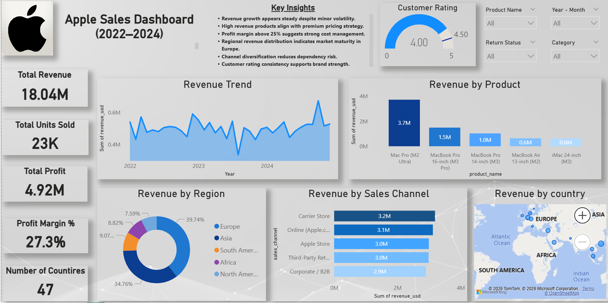

# 🍎 Apple Global Sales Dashboard (2022–2024)

An interactive Power BI dashboard built to analyze Apple's global sales performance from **2022 to 2024**. This dashboard provides insights into revenue, profit, customer ratings, product performance, regional sales distribution, and sales channels, enabling data-driven business decisions.

---

## 📊 Dashboard Preview



---

## 🚀 Project Overview

The **Apple Global Sales Dashboard** analyzes transactional sales data across multiple countries, products, and sales channels. It helps identify sales trends, high-performing products, profitable regions, and customer satisfaction metrics.

### Dataset Information

- **Total Records:** 11,500
- **Total Columns:** 27
- **Period Covered:** 2022–2024

---

## 📈 Key KPIs

- 💰 Total Revenue
- 📦 Total Units Sold
- 💵 Total Profit
- 📊 Profit Margin %
- 🌍 Number of Countries
- ⭐ Customer Rating

---

## 📌 Dashboard Features

### Revenue Analysis
- Revenue trend over time
- Revenue by product
- Revenue by region
- Revenue by sales channel
- Revenue by country (Map)

### Business Insights
- Top-performing products
- Regional sales contribution
- Channel-wise revenue comparison
- Customer satisfaction analysis
- Interactive filtering

---

## 🎯 Key Insights

- Revenue remained relatively steady with minor fluctuations.
- Premium products generated the highest revenue.
- Profit margin remained above **25%**, indicating healthy profitability.
- Europe contributed the highest share of revenue.
- Sales were well distributed across multiple channels, reducing dependency on a single channel.
- Customer ratings remained consistently high throughout the period.

---

## 🛠️ Tools & Technologies

- **Power BI Desktop**
- Power Query
- DAX
- Data Modeling
- Microsoft Bing Maps
- Excel (Data Source)

---

## 📂 Repository Structure

```
Apple-Global-Sales-Dashboard/
│
├── Dashboard.png
├── README.md
└── Dataset.xlsx 
```

---

## 📊 Dashboard Components

- KPI Cards
- Area Chart
- Bar Charts
- Donut Chart
- Gauge Chart
- Map Visualization
- Slicers
- Interactive Filters

---

## 🔍 Filters Available

- Product Name
- Year-Month
- Return Status
- Category

---

## 💡 Business Value

This dashboard helps businesses:

- Monitor global sales performance
- Identify high-revenue products
- Analyze regional demand
- Compare sales channels
- Track profitability
- Monitor customer satisfaction
- Support strategic decision-making

---

## 📸 Dashboard Snapshot

The dashboard includes:

- Executive KPI Summary
- Revenue Trend Analysis
- Product Performance
- Regional Revenue Distribution
- Sales Channel Comparison
- Geographic Revenue Map
- Customer Rating Gauge

---

## 👩‍💻 Author

**Parvathy S**

Data Analyst | Power BI Developer

- Power BI
- SQL
- Python
- Excel
- Tableau

---

